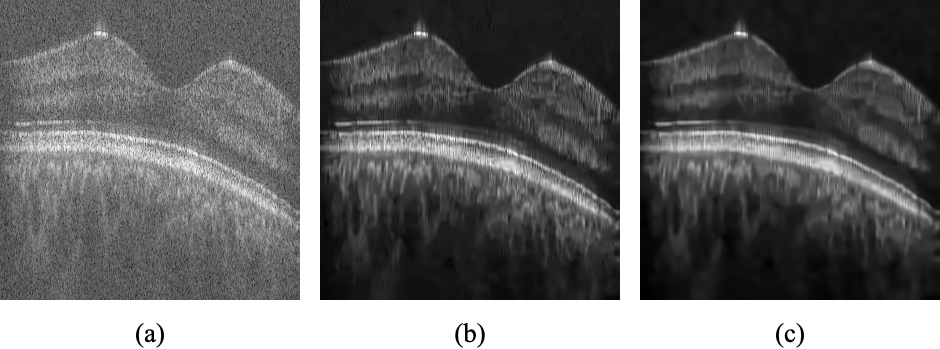

# crystal-uom/vipcup-2024

This repoistory contains the final solution code for Video and Image Processing Cup 2024 by Team Crystal.

# Contents

- [Problem Statement](#problem-statement)
- [Tasks](#tasks)
  - [1. De-noising of Noisy OCT Images](#1-de-noising-of-noisy-oct-images)
  - [2. Super-resolution](#2-super-resolution)
  - [3. Volume-based Classification of OCT Dataset into Sub-classes](#3-volume-based-classification-of-oct-dataset-into-sub-classes)
- [Keywords](#keywords)
- [Folder Structure](#folder-structure)
- [Methodology](#methodology)

# Problem Statement

Optical Coherence Tomography (OCT) is a retina non-invasive imaging technique widely used for the diagnosis and treatment of many eye-related diseases. Different anomalies such as Age-related Macular Degeneration (AMD), Diabetic Retinopathy (DR), or Diabetic Macular Edema (DME) can be diagnosed using OCT images. Due to the importance of early-stage and accurate diagnosis of eye-related diseases, providing high-resolution and clear OCT images is of high importance. Therefore, analyzing and processing OCT images has become one of the significant and applicable biomedical image processing research areas.

Various processes have been applied to OCT images, such as image super-resolution, image de-noising, image reconstruction, image classification, and image segmentation. Despite the many algorithms developed for OCT image analysis, there is still a need to improve the quality of the resulting images and the accuracy of classification. This challenge is dedicated to the problem of OCT image enhancement and classification.

VIP-Cup 2024 focuses on three key tasks in the analysis and processing of Optical Coherence Tomography (OCT) images:

1. **De-noising of Noisy OCT Images**
2. **Super-resolution of OCT Images**
3. **Volume-based Classification of OCT Dataset into Sub-classes**

## Tasks

### 1. De-noising of Noisy OCT Images

Many captured OCT images are noisy, which can significantly reduce the accuracy of diagnosing eye-related diseases. De-noising is, therefore, a crucial step in OCT image analysis. This task is dedicated to the problem of OCT image de-noising. The objective is to de-noise the available noisy OCT B-scans and produce the best possible results.

<!-- TODO: Add the noisy image to docs/images directory and change the follwoing image file path -->

*Figure 1: Stages of Denoising*

### 2. Super-resolution

To prevent motion artifacts, OCT images are often captured at rates lower than the nominal sampling rate, resulting in low-resolution images. Super-resolution methods can reconstruct high-resolution images from low-resolution ones. This task is focused on the super-resolution problem, with the aim of obtaining high-resolution OCT B-scans from low-resolution OCT B-scans.

### 3. Volume-based Classification of OCT Dataset into Sub-classes

The goal of this task is to classify observed cases, where several B-scans are available for each case, into three categories:

- Healthy (0)
- Diabetic patients with Diabetic Macular Edema (DME) (1)
- Non-diabetic patients with other ocular diseases (2)

### Keywords

- Optical Coherence Tomography (OCT)
- De-noising
- Super-resolution
- Classification

# Folder Structure

- denoising
    - bm3d
    - svd
- oct_classification
    - ensembled_cnn_method
    - saved_models

- super_resolution
- docs

# Methodology 

General overview of our proposed solution is as follows.

<!-- TODO: ADD IMAGES , Are we going to add images to the follwoing sections to show our proposed method? -->

1. Denoising
We address the denoising problem using a combination of two conventional denoising techniques: SVHT and BM3D. SVHT improves the Signal-to-Noise Ratio (SNR) and reduces fine noise, while BM3D enhances the Contrast-to-Noise Ratio (CNR) and overall image contrast. By combining these methods, we leverage their strengths in a pipelined system. The image first undergoes BM3D processing for initial enhancement, followed by SVHT for further noise reduction. This approach ensures efficient noise removal and image quality improvement.

2. Super-resolution
To enhance the resolution of OCT images, we employ the EDSR (Enhanced Deep Residual Networks for Single Image Super-Resolution) model. The denoised images are processed through a pre-trained EDSR model, which enhances their quality and resolution. After super-resolution, the images are downscaled to a standardized resolution using bicubic interpolation, which helps maintain image sharpness and visual fidelity.

3. Classification
For classification, we use a Convolutional Neural Network (CNN) with a pre-trained ResNet18 backbone. The network is fine-tuned to classify OCT images into three categories: healthy, diabetic with DME, and non-diabetic with other ocular diseases. The enhanced images are transformed and normalized before being fed into the network. The training involves initially focusing on the fully connected layers, followed by fine-tuning the ResNet18 encoder. For classification, we use ensemble averaging of predictions from 2D image slices to determine the class of the entire volumetric image.
